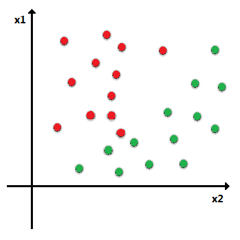
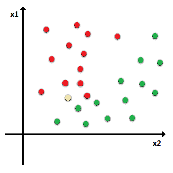
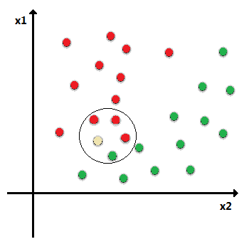
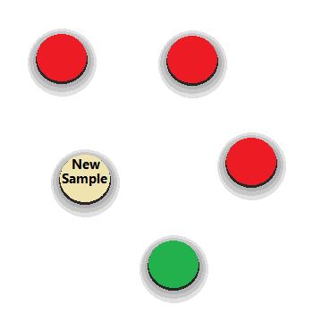
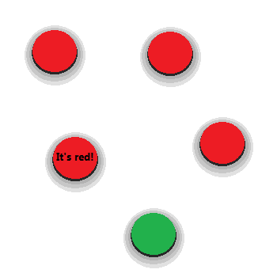

# K-Nearest Neighbors Algorithm

Docummentaton: https://scikit-learn.org/stable/modules/generated/sklearn.neighbors.KNeighborsClassifier.html


1. If you are looking for the K-NN method only, here it is:
    - Check the docummentation for the parametrization of "KNeighborsClassifier()".
    - <x_train>, <y_train> and <whatever_you_want> are data arrays that you have already pre-processed.
    ```py
    from sklearn.neighbors import KNeighborsClassifier
    classifier = KNeighborsClassifier() 
    classifier.fit( <x_train> , <y_train> )
    prediction = classifier.predict( <whatever_you_want> )
    ```


2. If you want to know more about the algorithm, including data processing (pre-processing, visualization and tuning):
    - Can you look the code into file "K-NN.py"
    - I'll draw a simple explanation:
        
        The K-nearest neighbors algorithm classifies a new sample based on the samples already registered. For example:
        
        i. A set of samples:
        
        
        
        ii. A new data appears:
        
        
        
        iii. We get the K nearest data. Suppose we choose K equal to 4, in this case:
        
        
        
        iv. The new data is classified based on the class with the most data among the 4 samples:
        
        
        
        v. Classify the new data:
        
        
